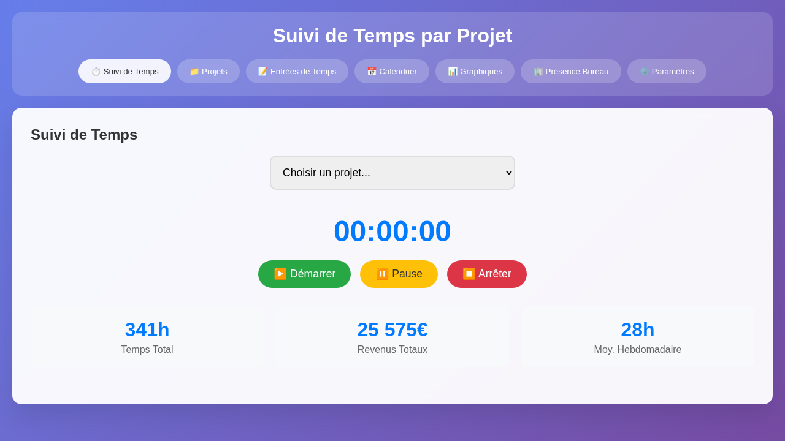
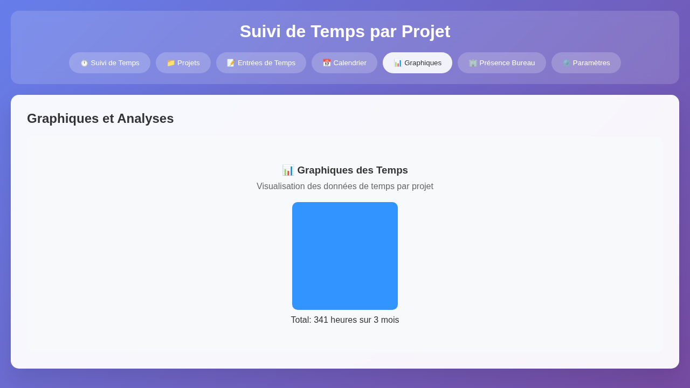
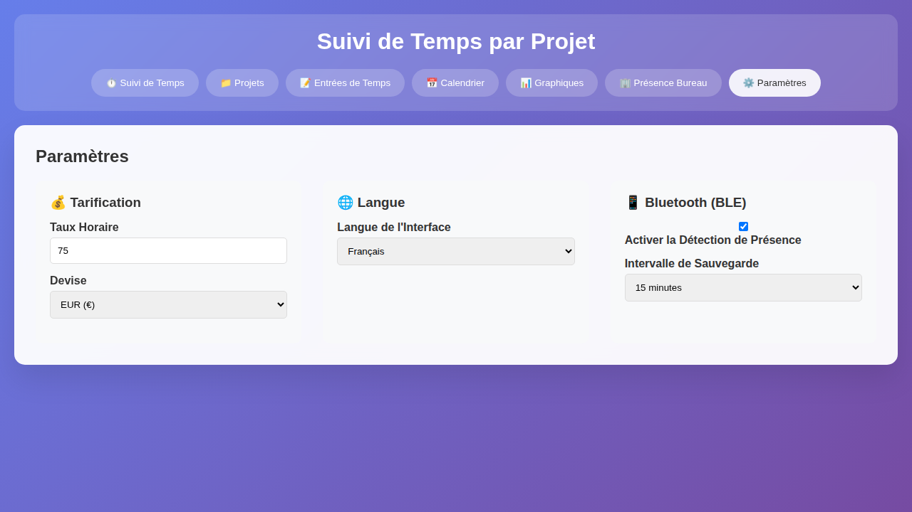
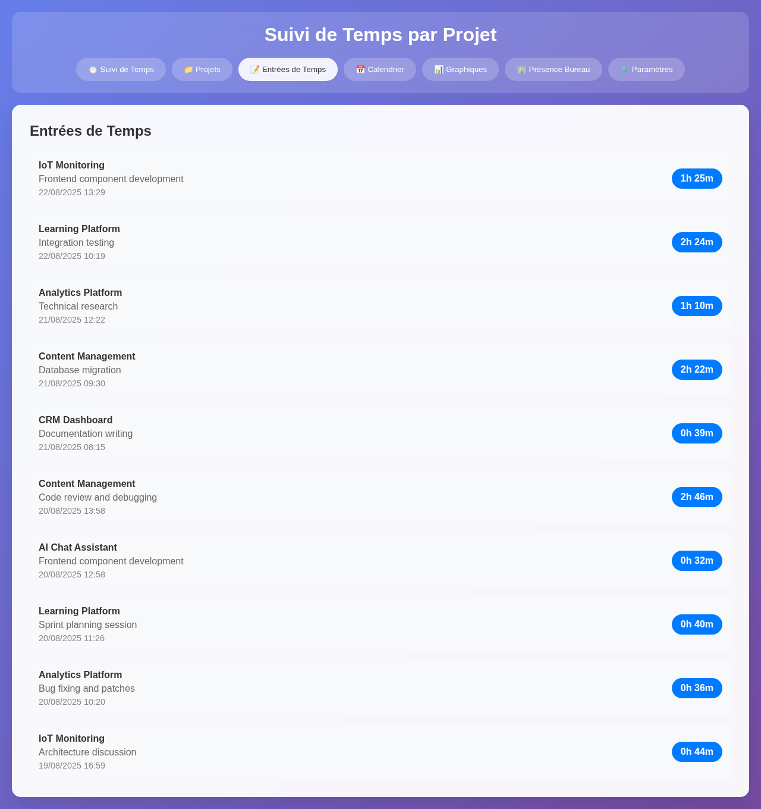
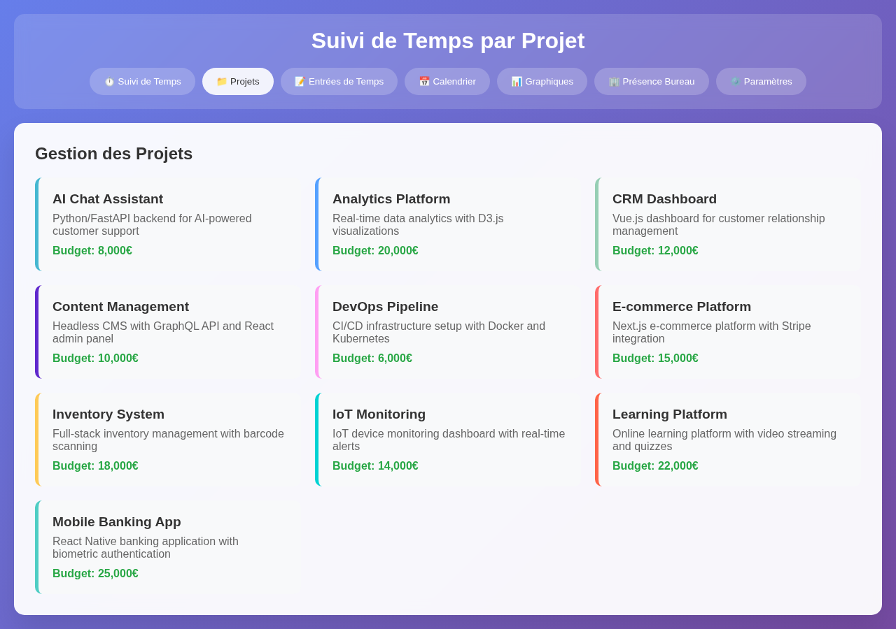
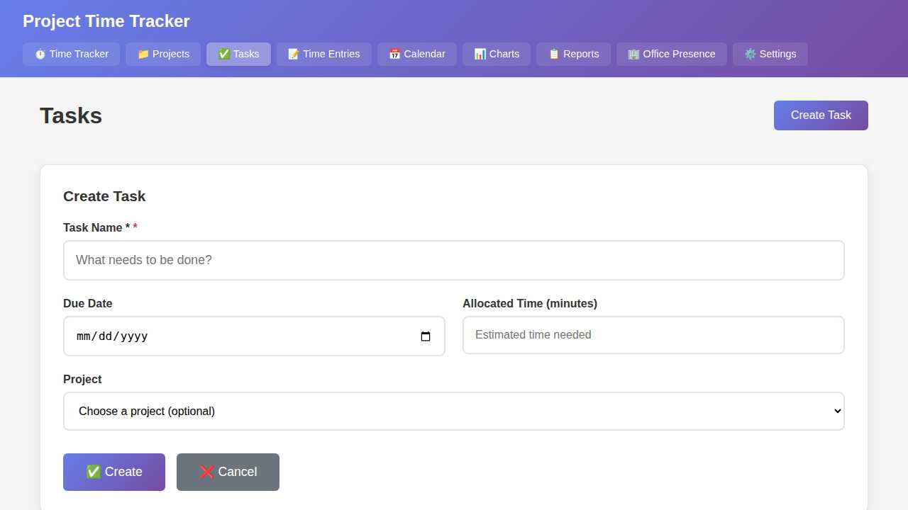
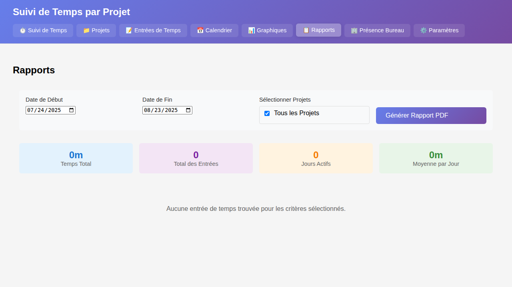
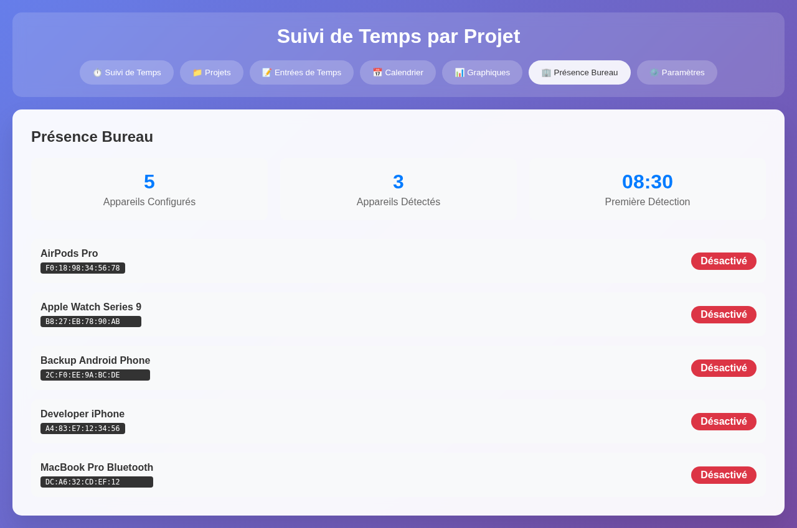
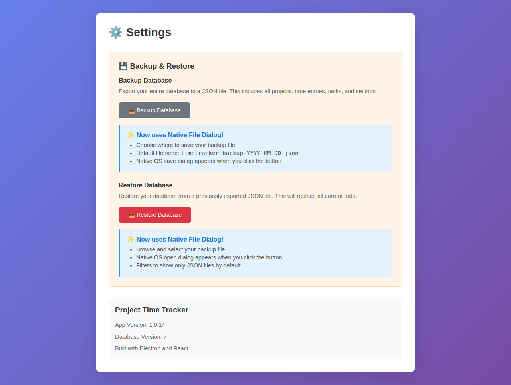

# Project Time Tracker

A cross-platform desktop application for tracking time spent on engineering projects with modern UI and local database storage.

## Available Implementations

This project is available in two implementations:

### 1. **Electron/React Version** (Original)
- Located in the root directory
- Built with Electron, React, and SQLite
- Web version available at [GitHub Pages](https://doumdi.github.io/project-time-tracker/)

### 2. **Qt/C++/QML Version** (New)
- Located in the `qt_app/` directory
- Built with Qt 6, C++17, and QML
- Native performance with smaller binary size
- See [Qt App README](qt_app/README.md) for details

Both implementations share the same database schema and can work with the same data files.

## 🌐 Try the Web Demo

Experience Project Time Tracker directly in your browser with pre-populated demo data:

**[Launch Web Demo →](https://doumdi.github.io/project-time-tracker/)**

The web demo runs entirely in your browser using an in-memory database. All data is temporary and stored locally in your browser - perfect for trying out the features without any installation!

> CAUTION : This project is completely generated by Copilot, use at your own risks.

Author(s) :

- Copilot for @doumdi

## Screenshots

> **Note:** All screenshots below are taken in demo mode with pre-populated sample data. See the [Demo Mode](#demo-mode) section to run the app with demo data.

### Time Tracker


### Charts


### Parameters


### Time Entries


### Projects


### Tasks


### Reports


### Office Presence


### Configurable Presence Settings


## Features

- ✅ **Cross-platform** - Works on Windows, macOS, and Linux
- ✅ **Project Management** - Add, edit, and delete projects with custom colors
- ✅ **Project Budgets & Earnings Tracking** - Set project budgets, track earnings based on hourly rates, and monitor remaining budget/hours
- ✅ **Multi-Currency Support** - Support for 20+ currencies with configurable hourly rates
- ✅ **Task Management** - Create, edit, and delete tasks with due dates, project association, and time allocation
- ✅ **Task Time Tracking** - Start/stop time tracking directly from tasks with automatic time entry creation
- ✅ **Cumulated Time Display** - Visual progress tracking showing actual time spent vs allocated time per task
- ✅ **Time Tracking** - Live timer with 5-minute precision rounding
- ✅ **Quick Entry** - Add past time entries manually
- ✅ **Office Presence Detection** - Automatic presence tracking using Bluetooth Low Energy (BLE) devices
- ✅ **Efficient BLE Monitoring** - Minute-by-minute periodic scanning (30 seconds scan every 60 seconds) for better battery efficiency
- ✅ **Real-time Device Detection** - Live status updates with flicker-free UI and detection counters
- ✅ **Enhanced Real-time Device Discovery** - Immediate display of discovered BLE devices with visual "NEW" badges and pulse animations
- ✅ **Configurable Presence Save Intervals** - User-configurable saving intervals (1-480 minutes, default 15 minutes)
- ✅ **Automatic Session Management** - Creates/ends presence sessions based on device proximity (2-minute timeout)
- ✅ **Real-time Detection Counters** - Live seconds counters for device detection and global session time
- ✅ **Enhanced Debugging** - Comprehensive console logging with BLE SCAN and PRESENCE MONITOR prefixes
- ✅ **MAC Address Highlighting** - Visual highlighting of Bluetooth MAC addresses in settings for easy identification
- ✅ **Filtering & Search** - Filter time entries by project, date, and description
- ✅ **Multiple Views** - Table view, calendar view (month/week/day), and charts
- ✅ **Charts & Analytics** - Visual representations of time data
- ✅ **Backup & Restore** - Export/import database to/from JSON files for easy backup and migration
- ✅ **Local Database** - SQLite database that's easy to backup and move
- ✅ **Internationalization** - English and French language support
- ✅ **Modern UI** - Clean, responsive design with real-time updates

## Technology Stack

### Electron Version (Original)

- **Electron** - Cross-platform desktop app framework
- **React** - Modern UI library
- **SQLite** - Local database for data storage
- **Chart.js** - Charts and visualizations
- **@stoprocent/noble** - Bluetooth Low Energy (BLE) device detection
- **Webpack** - Build tool

### Qt Version (New)

- **Qt 6** - Cross-platform application framework
- **C++17** - High-performance backend
- **QML** - Declarative UI language
- **Qt SQL** - Database module with SQLite support
- **Qt Bluetooth** - BLE device detection
- **Qt Charts** - Charts and visualizations
- **CMake** - Build system

See [qt_app/README.md](qt_app/README.md) for Qt version installation and build instructions.

## Installation & Setup

1. **Clone the repository**
   ```bash
   git clone https://github.com/doumdi/project-time-tracker.git
   cd project-time-tracker
   ```

2. **Install dependencies**
   ```bash
   npm install
   ```

3. **Development mode**
   ```bash
   # Terminal 1: Start the React dev server
   npm start
   
   # Terminal 2: Start Electron in development mode
   npm run electron-dev
   ```

4. **Build for production**
   ```bash
   # Build the React app
   npm run build
   
   # Run the production version
   npm run electron
   ```

5. **Package the app**
   ```bash
   # Create distributable packages
   npm run dist
   ```

## Demo Mode

Try the application with pre-populated demo data without affecting your real database!

**Run in demo mode:**
```bash
# Build the app first
npm run build

# Start in demo mode
npm run electron-demo
```

Or manually:
```bash
npm run electron -- --demo_mode
```

**Demo mode features:**
- ✅ **In-memory database** - No files created, all data is temporary
- ✅ **Pre-populated data** - 10 projects, 280+ time entries, 10 tasks over 3 months
- ✅ **Mock BLE devices** - 5 sample Bluetooth devices for testing presence tracking
- ✅ **Realistic work patterns** - Natural work hours (no weekends), breaks, and sessions
- ✅ **Perfect for screenshots** - Ideal for documentation and demonstrations

The window title will display "(DEMO MODE)" when running in demo mode. All data is lost when you close the application.

## Usage

### Getting Started

1. **Create Projects**: Start by adding your projects in the "Projects" tab
2. **Track Time**: Use the "Time Tracker" tab to start/stop timer or add quick entries
3. **Configure BLE Devices**: (Optional) Set up Bluetooth devices for automatic office presence detection in Settings
4. **Configure Presence Settings**: (Optional) Adjust presence save intervals (default 15 minutes) in Settings → Office Presence Detection
5. **View Entries**: Check all your time entries in the "Time Entries" tab
6. **Office Presence**: Monitor automatic presence detection with real-time counters in the "Office Presence" tab
7. **Calendar View**: See your work schedule in the "Calendar" tab
8. **Analytics**: View charts and statistics in the "Charts" tab

### Time Tracking

- **Live Timer**: Select a project and click "Start Timer" to begin tracking
- **Quick Entry**: Toggle "Quick Entry Mode" to add past work manually
- **5-minute Precision**: All durations are rounded to the nearest 5 minutes

### Office Presence Detection

- **Automatic Tracking**: Enable BLE device monitoring in Settings to track office presence automatically
- **Efficient Scanning**: Minute-by-minute periodic scanning (30 seconds scan every 60 seconds) for optimal battery efficiency
- **Real-time Monitoring**: Continuous scanning for registered Bluetooth devices (watches, phones, etc.) with live status updates
- **Smart Sessions**: Automatically creates presence sessions when devices are detected, ends when devices are out of range (2-minute timeout)
- **Configurable Save Intervals**: User-configurable presence save intervals (1-480 minutes, default 15 minutes) with automatic session rotation
- **Minimum Session Time**: Only sessions 1 minute or longer are saved
- **Live Status**: See real-time presence status with animated indicators and currently detected devices
- **Real-time Counters**: Live seconds counters for each detected device and global session timer with human-readable formatting
- **Enhanced Device Discovery**: Real-time BLE device discovery in settings with immediate display, visual "NEW" badges, pulse animations, and discovery timestamps
- **Daily Summaries**: View cumulative presence time for each day
- **Enhanced Debugging**: Comprehensive console logging with `[BLE SCAN]` and `[PRESENCE MONITOR]` prefixes for troubleshooting
- **MAC Address Highlighting**: Visual highlighting of Bluetooth MAC addresses in BLE settings for easy device identification

### BLE Device Management

- **Real-time Device Discovery**: Click "Start scan" in BLE settings to immediately see discovered devices as they are found
- **Visual Feedback**: Newly discovered devices show with animated green "NEW" badges and pulse effects
- **Live Device Counter**: Real-time counter showing number of devices found during scanning
- **Discovery Timestamps**: Each device shows when it was discovered for easy identification
- **MAC Address Display**: Bluetooth MAC addresses are visually highlighted with gray backgrounds for easy debugging
- **Device Clearing**: Discovered device list is automatically cleared before each new scan for fresh results
- **Enhanced Reliability**: Improved event handling prevents duplicate listeners and ensures stable real-time updates

### Data Management

- **Database Location**: Your data is stored locally in SQLite database
  - Windows: `%APPDATA%/project-time-tracker/timetracker.db`
  - macOS: `~/Library/Application Support/project-time-tracker/timetracker.db`
  - Linux: `~/.config/project-time-tracker/timetracker.db`

- **Backup & Restore**: Use the built-in backup/restore feature in Settings with native file dialogs
  - **Backup**: Export your entire database to a JSON file using native OS save dialog
  - **Restore**: Import a previously exported JSON backup using native OS open dialog
  - **Native File Dialogs**: Choose where to save backups and browse for restore files with familiar OS dialogs
  - **Manual Backup**: You can also copy the database file directly for backup
  


**Note**: Backup and restore work across different database versions, making it easy to migrate data between different versions of the application.

## Development

### Project Structure

```
src/
├── app/                 # React application
│   ├── App.js          # Main app component
│   ├── index.js        # Entry point
│   ├── index.html      # HTML template
│   └── styles.css      # Global styles
├── components/         # React components
│   ├── ProjectManager.js
│   ├── TimeTracker.js
│   ├── TimeEntryList.js
│   ├── CalendarView.js
│   ├── ChartsView.js
│   ├── OfficePresenceView.js    # Office presence tracking with real-time counters
│   ├── BleDevicesView.js        # BLE device management with real-time discovery
│   └── Settings.js              # Settings with configurable presence intervals
├── contexts/            # React contexts
│   ├── LanguageContext.js       # Internationalization support
│   └── SettingsContext.js       # Application settings context
├── database/           # Database operations
│   └── db.js          # SQLite database interface
├── translations/       # Localization files
│   ├── en.json        # English translations
│   └── fr.json        # French translations
├── main.js            # Electron main process with BLE handlers
└── preload.js         # Electron preload script with IPC bridge
```

### Database Schema

**Projects Table**
- `id` - Primary key
- `name` - Project name (unique)
- `description` - Optional description
- `color` - Hex color code
- `budget` - Project budget (decimal)
- `start_date` - Project start date
- `end_date` - Project end date
- `created_at`, `updated_at` - Timestamps

**Time Entries Table**
- `id` - Primary key
- `project_id` - Foreign key to projects
- `description` - Optional description
- `start_time` - ISO datetime string
- `end_time` - ISO datetime string
- `duration` - Duration in minutes
- `created_at`, `updated_at` - Timestamps

**BLE Devices Table** (v4+)
- `id` - Primary key
- `name` - Device display name
- `address` - Bluetooth MAC address (unique)
- `device_type` - Device type (watch, phone, etc.)
- `is_active` - Whether device is enabled for monitoring
- `created_at`, `updated_at` - Timestamps

**Office Presence Table** (v4+)
- `id` - Primary key
- `date` - Presence date
- `start_time` - Session start time (ISO datetime)
- `end_time` - Session end time (ISO datetime)
- `duration` - Session duration in minutes
- `device_id` - Foreign key to BLE devices (optional)
- `created_at`, `updated_at` - Timestamps

## Building for Distribution

### Desktop Applications

#### Windows
```bash
npm run dist
# Creates: dist/Project Time Tracker Setup 1.0.4.exe
```

#### macOS
```bash
npm run dist
# Creates: dist/Project Time Tracker-1.0.4.dmg
```

#### Linux
```bash
npm run dist
# Creates: dist/Project Time Tracker-1.0.4.AppImage
```

### Web Version

Build the web version for deployment to static hosting (e.g., GitHub Pages):

```bash
npm run build:web
# Creates: dist-web/ directory with static files
```

The web version:
- Runs entirely in the browser using sql.js (in-memory SQLite)
- Automatically starts in demo mode with sample data
- All data is stored locally in the browser
- No server-side components required
- Perfect for demonstrations and trying out features

## Troubleshooting

### BLE (Bluetooth Low Energy) Issues

**macOS:**
- Ensure Bluetooth is enabled in System Preferences
- Grant Bluetooth permission to the app when prompted
- If installation fails with Python 3.13+, the app now uses `@stoprocent/noble` for better compatibility
- Install Xcode command line tools if needed: `xcode-select --install`

**Windows:**
- Enable Bluetooth in Windows Settings
- Ensure the app has Bluetooth permissions
- Some USB Bluetooth adapters may not support BLE

**Linux:**
- Install required packages: `sudo apt-get install bluetooth bluez libbluetooth-dev libudev-dev`
- Ensure your user is in the `bluetooth` group: `sudo usermod -a -G bluetooth $USER`
- Restart after adding to the group

**General:**
- BLE features are optional - the app works fully without them
- If BLE is not available, presence tracking will be disabled
- Check that your Bluetooth adapter supports BLE (Bluetooth 4.0+)
- **Enhanced Debugging**: Enable debug mode by opening Developer Tools (Ctrl+Shift+I / Cmd+Option+I) to see detailed BLE scanning logs with `[BLE SCAN]` and `[PRESENCE MONITOR]` prefixes
- **Device Discovery Issues**: If devices aren't appearing in real-time, check the console for scan events and ensure Bluetooth permissions are granted
- **MAC Address Identification**: Use the highlighted MAC addresses in BLE settings to identify and match your devices
- **Performance**: The app uses efficient periodic scanning (30s every minute) to balance detection accuracy with battery life

## License

MIT License - see [LICENSE](LICENSE) file for details.

## Contributing

1. Fork the repository
2. Create a feature branch
3. Make your changes
4. Test thoroughly
5. Submit a pull request
