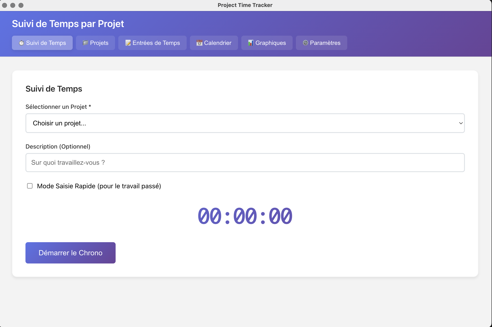
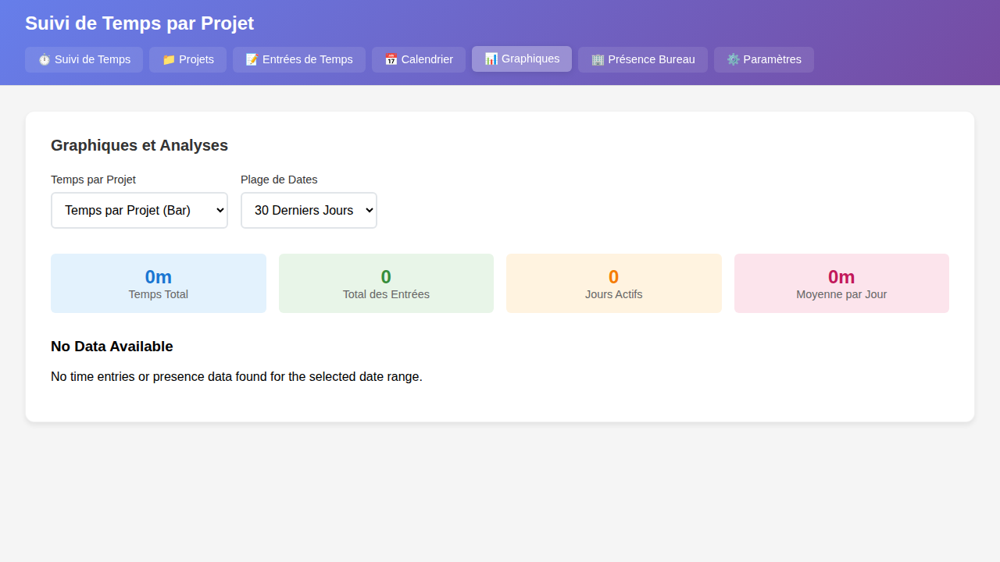
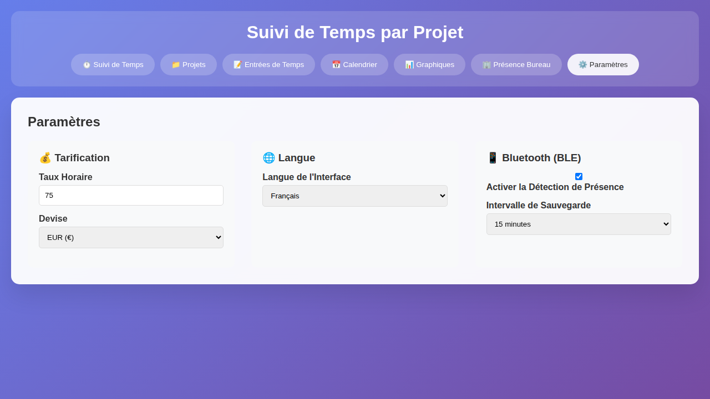
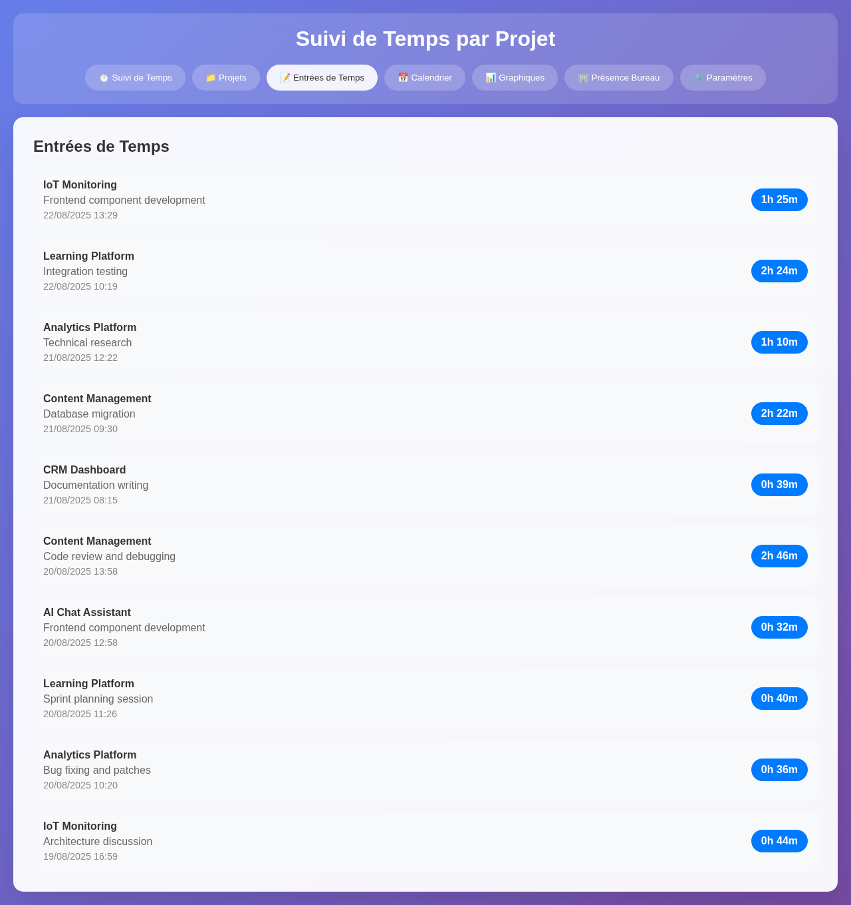
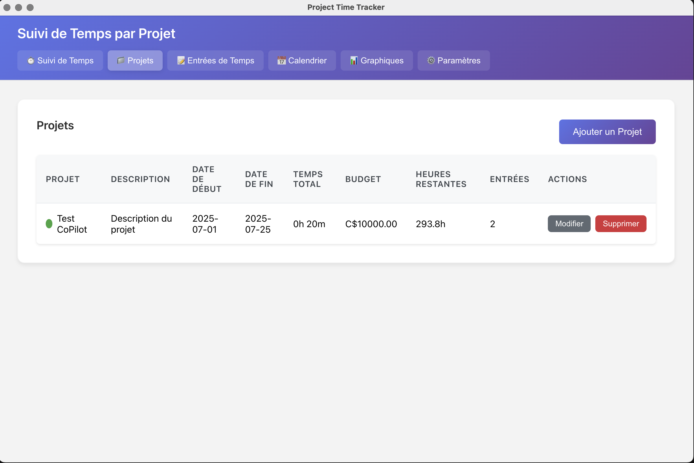

# Project Time Tracker

A cross-platform desktop application for tracking time spent on engineering projects with modern UI and local database storage.

> CAUTION : This project is completely generated by Copilot, use at your own risks.

Author(s) :

- Copilot for @doumdi

## Screenshots

### Time Tracker


### Charts


### Parameters


### Time Entries


### Projects


### Office Presence


## Features

- ✅ **Cross-platform** - Works on Windows, macOS, and Linux
- ✅ **Project Management** - Add, edit, and delete projects with custom colors
- ✅ **Time Tracking** - Live timer with 5-minute precision rounding
- ✅ **Quick Entry** - Add past time entries manually
- ✅ **Office Presence Detection** - Automatic presence tracking using Bluetooth Low Energy (BLE) devices
- ✅ **Real-time BLE Monitoring** - Continuous scanning for registered devices with live status updates
- ✅ **Automatic Session Management** - Creates/ends presence sessions based on device proximity
- ✅ **Filtering & Search** - Filter time entries by project, date, and description
- ✅ **Multiple Views** - Table view, calendar view (month/week/day), and charts
- ✅ **Charts & Analytics** - Visual representations of time data
- ✅ **Local Database** - SQLite database that's easy to backup and move
- ✅ **Modern UI** - Clean, responsive design

## Technology Stack

- **Electron** - Cross-platform desktop app framework
- **React** - Modern UI library
- **SQLite** - Local database for data storage
- **Chart.js** - Charts and visualizations
- **@stoprocent/noble** - Bluetooth Low Energy (BLE) device detection
- **Webpack** - Build tool

## Installation & Setup

1. **Clone the repository**
   ```bash
   git clone https://github.com/doumdi/project-time-tracker.git
   cd project-time-tracker
   ```

2. **Install dependencies**
   ```bash
   npm install
   ```

3. **Development mode**
   ```bash
   # Terminal 1: Start the React dev server
   npm start
   
   # Terminal 2: Start Electron in development mode
   npm run electron-dev
   ```

4. **Build for production**
   ```bash
   # Build the React app
   npm run build
   
   # Run the production version
   npm run electron
   ```

5. **Package the app**
   ```bash
   # Create distributable packages
   npm run dist
   ```

## Usage

### Getting Started

1. **Create Projects**: Start by adding your projects in the "Projects" tab
2. **Track Time**: Use the "Time Tracker" tab to start/stop timer or add quick entries
3. **Configure BLE Devices**: (Optional) Set up Bluetooth devices for automatic office presence detection in Settings
4. **View Entries**: Check all your time entries in the "Time Entries" tab
5. **Office Presence**: Monitor automatic presence detection in the "Office Presence" tab
6. **Calendar View**: See your work schedule in the "Calendar" tab
7. **Analytics**: View charts and statistics in the "Charts" tab

### Time Tracking

- **Live Timer**: Select a project and click "Start Timer" to begin tracking
- **Quick Entry**: Toggle "Quick Entry Mode" to add past work manually
- **5-minute Precision**: All durations are rounded to the nearest 5 minutes

### Office Presence Detection

- **Automatic Tracking**: Enable BLE device monitoring in Settings to track office presence automatically
- **Real-time Monitoring**: Continuous scanning for registered Bluetooth devices (watches, phones, etc.)
- **Smart Sessions**: Automatically creates presence sessions when devices are detected, ends when devices are out of range (2-minute timeout)
- **Minimum Session Time**: Only sessions 1 minute or longer are saved
- **Live Status**: See real-time presence status and currently detected devices
- **Daily Summaries**: View cumulative presence time for each day

### Data Management

- **Database Location**: Your data is stored locally in SQLite database
  - Windows: `%APPDATA%/project-time-tracker/timetracker.db`
  - macOS: `~/Library/Application Support/project-time-tracker/timetracker.db`
  - Linux: `~/.config/project-time-tracker/timetracker.db`

- **Backup**: Simply copy the database file to backup your data
- **Restore**: Replace the database file to restore from backup

## Development

### Project Structure

```
src/
├── app/                 # React application
│   ├── App.js          # Main app component
│   ├── index.js        # Entry point
│   ├── index.html      # HTML template
│   └── styles.css      # Global styles
├── components/         # React components
│   ├── ProjectManager.js
│   ├── TimeTracker.js
│   ├── TimeEntryList.js
│   ├── CalendarView.js
│   ├── ChartsView.js
│   ├── OfficePresenceView.js  # Office presence tracking
│   ├── BleDevicesView.js      # BLE device management
│   └── Settings.js
├── database/           # Database operations
│   └── db.js          # SQLite database interface
├── main.js            # Electron main process
└── preload.js         # Electron preload script
```

### Database Schema

**Projects Table**
- `id` - Primary key
- `name` - Project name (unique)
- `description` - Optional description
- `color` - Hex color code
- `budget` - Project budget (decimal)
- `start_date` - Project start date
- `end_date` - Project end date
- `created_at`, `updated_at` - Timestamps

**Time Entries Table**
- `id` - Primary key
- `project_id` - Foreign key to projects
- `description` - Optional description
- `start_time` - ISO datetime string
- `end_time` - ISO datetime string
- `duration` - Duration in minutes
- `created_at`, `updated_at` - Timestamps

**BLE Devices Table** (v4+)
- `id` - Primary key
- `name` - Device display name
- `address` - Bluetooth MAC address (unique)
- `device_type` - Device type (watch, phone, etc.)
- `is_active` - Whether device is enabled for monitoring
- `created_at`, `updated_at` - Timestamps

**Office Presence Table** (v4+)
- `id` - Primary key
- `date` - Presence date
- `start_time` - Session start time (ISO datetime)
- `end_time` - Session end time (ISO datetime)
- `duration` - Session duration in minutes
- `device_id` - Foreign key to BLE devices (optional)
- `created_at`, `updated_at` - Timestamps

## Building for Distribution

### Windows
```bash
npm run dist
# Creates: dist/Project Time Tracker Setup 1.0.0.exe
```

### macOS
```bash
npm run dist
# Creates: dist/Project Time Tracker-1.0.0.dmg
```

### Linux
```bash
npm run dist
# Creates: dist/Project Time Tracker-1.0.0.AppImage
```

## Troubleshooting

### BLE (Bluetooth Low Energy) Issues

**macOS:**
- Ensure Bluetooth is enabled in System Preferences
- Grant Bluetooth permission to the app when prompted
- If installation fails with Python 3.13+, the app now uses `@stoprocent/noble` for better compatibility
- Install Xcode command line tools if needed: `xcode-select --install`

**Windows:**
- Enable Bluetooth in Windows Settings
- Ensure the app has Bluetooth permissions
- Some USB Bluetooth adapters may not support BLE

**Linux:**
- Install required packages: `sudo apt-get install bluetooth bluez libbluetooth-dev libudev-dev`
- Ensure your user is in the `bluetooth` group: `sudo usermod -a -G bluetooth $USER`
- Restart after adding to the group

**General:**
- BLE features are optional - the app works fully without them
- If BLE is not available, presence tracking will be disabled
- Check that your Bluetooth adapter supports BLE (Bluetooth 4.0+)

## License

MIT License - see [LICENSE](LICENSE) file for details.

## Contributing

1. Fork the repository
2. Create a feature branch
3. Make your changes
4. Test thoroughly
5. Submit a pull request
